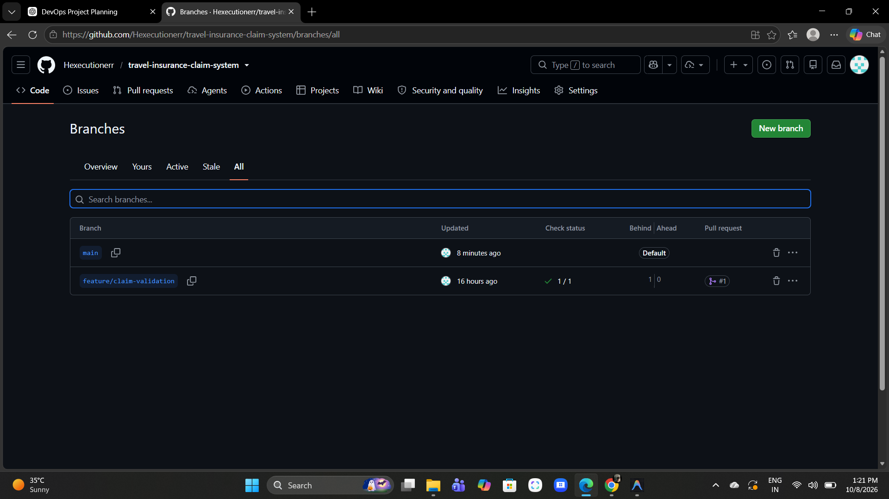
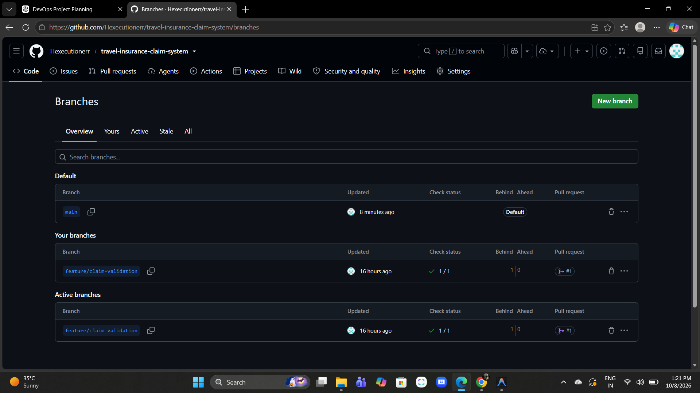

# Task 6 — MVP Completion and Git Collaboration

## 1. Objective
This task finalizes the Minimum Viable Product (MVP) for the Travel Insurance Claim System, demonstrates Git collaboration including branch management and conflict resolution, and establishes the v1.0.0 release baseline for the application.

## 2. MVP Verification
The following core flows have been implemented, tested, and verified as part of the MVP:
- Customer submits a travel insurance claim.
- Customer tracks claim status.
- Reviewer views pending claims.
- Reviewer approves or rejects claims.
- Customer sees the updated final status.
- Claim validation is implemented and tested.

## 3. Git Collaboration
- **Branches Created:** A feature branch named `feature/claim-validation` was created for collaborative development.
- **Pull Request:** A Pull Request (#1) was successfully opened from `feature/claim-validation` to `main`.
- **Merge Conflict Setup:** As observed on the GitHub repository branches page, `main` was updated recently (8 minutes ago) while `feature/claim-validation` was updated 16 hours ago. The feature branch is currently shown as 1 commit behind `main`. This divergence sets up the intentional merge conflict for this task.

## 4. Conflict Resolution
*[PLACEHOLDER: Document the actual merge conflict encountered and the steps taken to resolve it here]*

## 5. Release Baseline
*[PLACEHOLDER: Document the v1.0.0 release, Git tag information, and baseline state here]*

## 6. Evidence
- [x] Screenshot/Evidence of branch creation and collaboration (GitHub Branches page showing `feature/claim-validation` and PR #1)
   
   
- [ ] *[PLACEHOLDER: Screenshot/Evidence of the Git merge conflict]*
- [ ] *[PLACEHOLDER: Screenshot/Evidence of successful conflict resolution]*
- [ ] *[PLACEHOLDER: Screenshot/Evidence of the v1.0.0 release/tag]*Branch B demonstrates a separate collaborative documentation update before the final MVP release.
